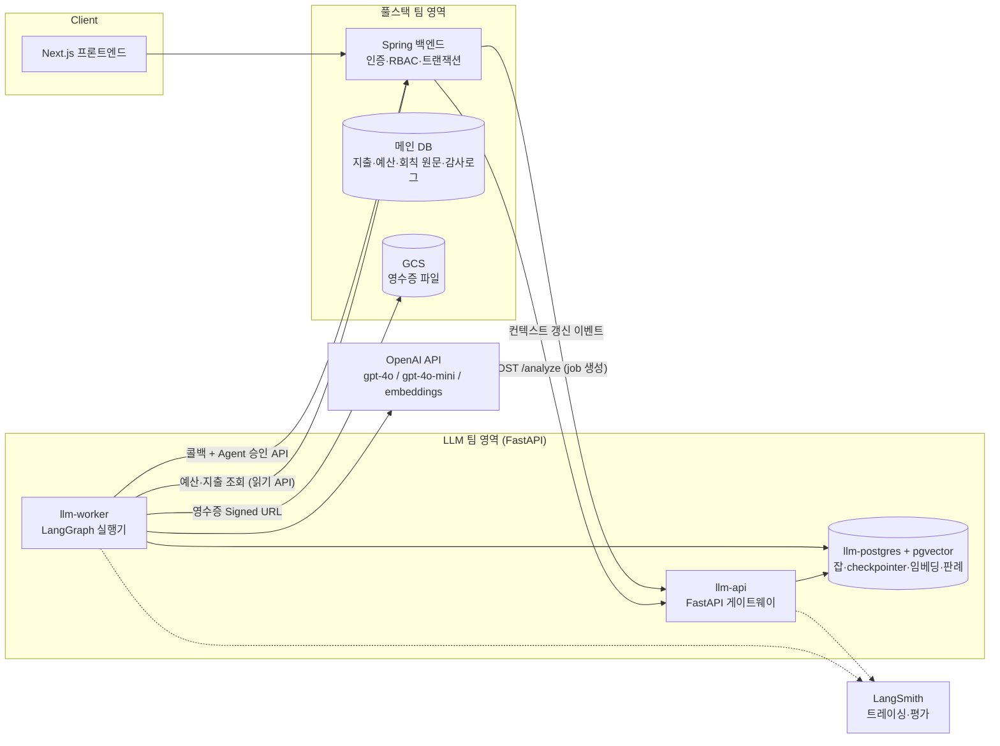
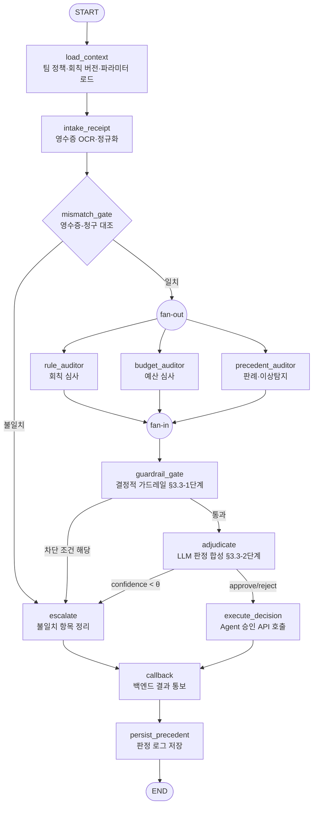
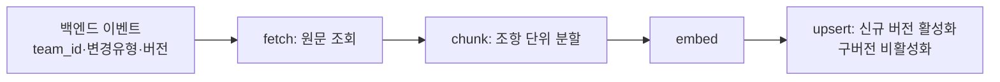
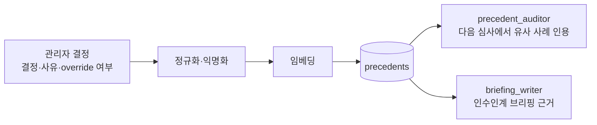
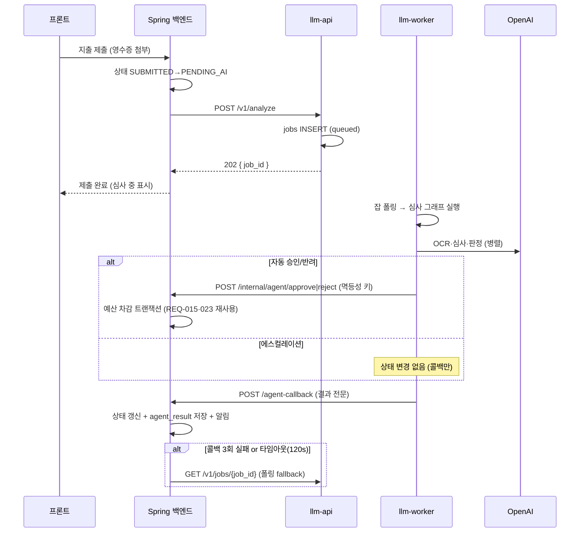
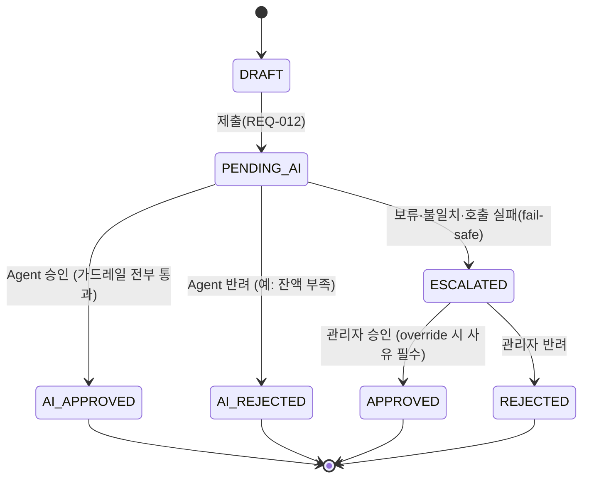
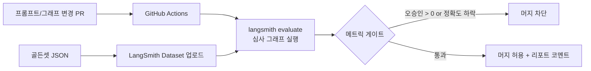

# BudgetOps — LLM 에이전트 아키텍처·워크플로우 설계서

| 항목 | 내용 |
|---|---|
| 문서 버전 | v1.0 (2026-07-06) |
| 작성 | LLM 에이전트 개발팀 |
| 근거 문서 | `요구사항정의서_LLM제안.xlsx`, `풀스택_협의_회의자료_LLM팀.md`, 화면목업 v2 |
| 대상 독자 | LLM 팀(구현 기준), 풀스택 팀(인터페이스 계약 확인) |

---

## 1. 개요와 설계 목표

BudgetOps는 모임(동아리·스터디·회사 등)의 지출 요청을 **AI가 회칙·예산·과거 판례 컨텍스트에 근거해 1차 심사**하고, 확신이 없는 건만 관리자에게 에스컬레이션하는 서비스다. LLM 에이전트는 "의견을 다는 참고인"이 아니라 **승인/반려의 실행 주체**이며, 그만큼 안전장치(금액 가드레일, fail-safe 에스컬레이션, 전 판정 감사로그)를 아키텍처 수준에서 보장한다.

### 1.1 에이전트가 담당하는 기능 (요구사항 매핑)

| 기능 | 관련 REQ | 에이전트 역할 |
|---|---|---|
| 지출 자동 심사 | REQ-012·014·015·016·028·038·039 | 영수증 OCR → 병렬 심사 → 승인/반려/에스컬레이션 |
| 예산안 기획·에이전트 설정 | REQ-004·036 | 온보딩 마법사에서 유형별 예산 템플릿·회칙 초안 생성 |
| 컨텍스트 관리 | REQ-035·041 | 회칙·정책 버전별 재인덱싱 (RAG 인덱스) |
| 판례 학습 루프 | REQ-042 | 관리자 결정을 임베딩 저장 → 유사 사례 검색에 재사용 |
| 문서 생성 | REQ-019·020·043 | 정산 리포트 AI 요약, 인수인계 브리핑 |

### 1.2 평가요소 ↔ 설계 매핑

| 평가요소 | 이 문서의 대응 |
|---|---|
| 1. 주제 선정 — 목적성·필요성 | §1: 승인 주체로서의 에이전트, 안전장치 전제 |
| 2. 멀티 에이전트·병렬 시스템 / 성능 평가 | §3 병렬 심사 패널, §9 LangSmith 골든셋 평가 |
| 3. 하네스 — 스킬·툴(MCP), 단일책임 노드·미들웨어 | §4 LangGraph 노드 설계, §5 툴·MCP·프롬프트 버전 관리 |
| 4. 모델 배포 — FastAPI 안정성, Docker | §10 배포 설계 |
| 5. 협업·문서화 | §7 API 계약, §11 GitHub·Jira·ADR |
| 6. 유지보수·확장성 | §12 확장 포인트, 부록 A ADR |

### 1.3 확정된 기술 결정 (ADR 요약 — 상세는 부록 A)

| # | 결정 | 선택 | 핵심 근거 |
|---|---|---|---|
| ADR-1 | LLM 제공자 | OpenAI GPT-4o 계열 | Vision(영수증 OCR)까지 단일 API, 심사는 gpt-4o / 분류·요약은 gpt-4o-mini 라우팅 |
| ADR-2 | 벡터 저장소·checkpointer | Postgres + pgvector 단일 | 컨테이너 1개로 checkpointer·벡터·판례·잡 테이블 통합, 운영 부담 최소 |
| ADR-3 | 성능 평가 | LangSmith + 골든셋 | LangGraph 네이티브 트레이싱, 데이터셋 회귀 평가, LLM-as-Judge |
| ADR-4 | 비동기 잡 처리 | Postgres 잡 테이블 + 전용 워커 프로세스 | Redis/Celery 없이 재시도·상태 추적 가능, 확장 시 교체 경로 명시(§12) |
| ADR-5 | 문서화 | Markdown + Mermaid, 리포 커밋 | PR 리뷰로 계약 변경 추적 |

---

## 2. 시스템 아키텍처

### 2.1 컨테이너 구성도



### 2.2 컴포넌트 책임

| 컴포넌트 | 책임 | 하지 않는 것 |
|---|---|---|
| **llm-api** (FastAPI) | 요청 수신·검증·인증(서비스 토큰), 잡 등록, 잡 상태 조회, 헬스체크, MCP 서버 마운트 | LLM 호출 (그래프 실행은 워커에 위임) |
| **llm-worker** | 잡 폴링, LangGraph 그래프 실행, 콜백 발송, 재시도·타임아웃 관리 | HTTP 요청 수신 |
| **llm-postgres** | `jobs`, LangGraph checkpointer, `context_chunks`(pgvector), `precedents`, `prompt_versions` | 지출·예산 원본 (소유권은 메인 DB) |
| **Spring 백엔드** | 인증·RBAC, 지출 상태 머신, 예산 차감 트랜잭션(REQ-015·023), 감사로그, 알림 | LLM 호출 |

API 서버와 워커는 **같은 Docker 이미지, 다른 entrypoint**로 실행한다. 코드 중복 없이 수평 확장 시 워커만 늘릴 수 있다.

### 2.3 데이터 경계 (회의 합의 사항 반영)

| 데이터 | 소유 | 비고 |
|---|---|---|
| 지출·예산·멤버·역할 | 메인 DB (풀스택) | LLM 팀은 읽기 API로만 접근 |
| 회칙·정책 **원문 + 버전** | 메인 DB (풀스택) | 변경 시 REQ-041 이벤트 발행 |
| 회칙 **임베딩 인덱스** | llm-postgres (LLM) | `rule_version`으로 원문과 동기화 |
| 판례(결정 로그) | llm-postgres (LLM) | REQ-042. 백엔드 감사로그에는 판정 요약만 중복 기록 |
| AI 판정 결과 스냅샷 | 메인 DB `expenses.agent_result` | 화면 표시용. 원본 트레이스는 LangSmith |
| 영수증 파일 | GCS (풀스택) | LLM 팀은 Signed URL로 시한부 접근 (REQ-025) |

**원칙: LLM 서버는 메인 DB에 직접 접속하지 않는다.** 모든 상태 변경은 백엔드 API(Agent 서비스 계정)를 경유해 트랜잭션·동시성 제어·감사로그를 재사용한다(REQ-038). 이 경계 덕분에 양팀은 API 계약(§7)만 지키면 독립 배포·독립 스케일이 가능하다.

---

## 3. 멀티 에이전트 설계

### 3.1 에이전트 카탈로그

역할이 다른 에이전트를 그래프 노드로 분리하고, 심사 계열은 **병렬(fan-out) 실행**한다.

| 에이전트 | 유형 | 모델 | 책임 (단일) |
|---|---|---|---|
| **Intake** | 전처리 | gpt-4o (Vision) | 영수증 OCR: 금액·날짜·상호·품목 추출, 청구 내용과 대조(REQ-028) |
| **RuleAuditor** (회칙 심사관) | 병렬 심사 | gpt-4o | 회칙 RAG 검색 → 위반 여부·근거 조항 판정 |
| **BudgetAuditor** (예산 심사관) | 병렬 심사 | gpt-4o-mini + 결정적 계산 | 카테고리 한도·잔액·기간 사용률 검사. 수치 계산은 툴(코드)로, LLM은 해석만 |
| **PrecedentAuditor** (판례·이상탐지 심사관) | 병렬 심사 | gpt-4o | 유사 판례 검색(pgvector), 중복 청구·패턴 이상 탐지 |
| **Adjudicator** (판정 합성) | 합류 | gpt-4o + 결정적 가드레일 | 3개 소견 종합 → verdict·confidence·사유(요청자용/관리자용) 생성 |
| **PolicyDrafter** | 독립 그래프 | gpt-4o | 마법사 3경로 중 "AI 초안" — 모임 유형 기반 회칙·예산 템플릿 생성(REQ-036) |
| **ReportWriter** | 독립 그래프 | gpt-4o-mini | 정산 리포트 AI 요약(REQ-019), 집계 수치는 백엔드 API 결과를 그대로 사용 |
| **BriefingWriter** | 독립 그래프 | gpt-4o | 인수인계 브리핑 — 판례 로그 기반, 회칙 vs 실운영 갭 분석, 익명화(REQ-043) |
| **Indexer** | 파이프라인(비 LLM) | embeddings | REQ-041 이벤트 수신 → 청크·임베딩·버전 태깅 |

> 모델 라우팅 원칙: **판단이 필요한 곳은 gpt-4o, 요약·분류·해석은 gpt-4o-mini.** 라우팅은 설정 파일(`models.yaml`)로 관리해 코드 수정 없이 교체 가능(§12).

### 3.2 왜 병렬 3-심사관 구조인가

- **관심사 분리**: 회칙 해석(비정형 텍스트 추론), 예산 검사(수치·결정적), 이상 탐지(유사도 검색)는 요구하는 컨텍스트·프롬프트·툴이 서로 다르다. 단일 프롬프트에 합치면 컨텍스트가 비대해지고 실패 원인 추적이 불가능해진다.
- **지연시간**: 3개 심사를 순차 실행하면 p95가 3배로 늘어난다. LangGraph의 fan-out으로 동시 실행해 전체 지연을 가장 느린 심사관 1개 수준으로 유지한다.
- **부분 실패 격리**: 심사관 1개가 실패해도 나머지 소견은 보존되고, Adjudicator가 "소견 불충분 → ESCALATED"로 안전하게 수렴한다(§8).
- **평가 용이성**: 심사관별 골든셋을 분리해 성능을 독립 측정·개선할 수 있다(§9).

### 3.3 판정 합성 규칙 (Adjudicator)

합성은 2단계다. **1단계는 코드(결정적), 2단계만 LLM.**

```
1단계 — 가드레일 (코드, LLM 개입 불가):
  IF 심사관 중 하나라도 실패/타임아웃        → ESCALATED
  IF 영수증-청구 불일치 (REQ-028)            → ESCALATED (불일치 항목 첨부)
  IF 회칙 위반 판정 OR 중복 의심             → ESCALATED (금액 무관)
  IF 금액 > auto_approve_limit (팀 설정)     → ESCALATED
  IF 금액 > force_escalation_amount          → ESCALATED
  IF 예산 잔액 부족                          → AI_REJECTED 후보 (2단계로)

2단계 — LLM 합성 (1단계 통과 건만):
  3개 소견 + 유사 판례를 근거로 verdict(approve/reject) + confidence 산출
  confidence < threshold (기본 0.8)          → ESCALATED
  사유 2종 생성: 요청자용(정중·간결) / 관리자용(근거 조항·수치 포함)
```

즉 **AI가 자동 승인할 수 있는 건 "모든 가드레일 통과 + 고신뢰" 건뿐**이며, 관리자가 `auto_approve_limit=0`으로 설정하면 전건 수동 모드가 된다(협의 시 합의된 안전장치).

---

## 4. LangGraph 워크플로우

### 4.1 지출 심사 그래프 (메인 워크플로우)



### 4.2 노드 단일책임 정의

각 노드는 **입력 상태의 일부만 읽고, 자신 몫의 키만 쓴다.** 노드 간 결합은 상태 스키마로만 존재한다.

| 노드 | 읽는 키 | 쓰는 키 | 부수효과 |
|---|---|---|---|
| `load_context` | team_id | policy_params, rule_version | 없음 (읽기 전용) |
| `intake_receipt` | receipt_url | receipt_data | GCS 읽기, Vision 호출 |
| `mismatch_gate` | receipt_data, claim | mismatch[] | 없음 (순수 비교) |
| `rule_auditor` | claim, rule_version | opinions.rule | pgvector 검색, LLM 호출 |
| `budget_auditor` | claim, policy_params | opinions.budget | 백엔드 예산 조회 API |
| `precedent_auditor` | claim | opinions.precedent | pgvector 검색, LLM 호출 |
| `guardrail_gate` | opinions, policy_params, mismatch | gate_result | 없음 (순수 함수 — 단위 테스트 100% 커버 대상) |
| `adjudicate` | opinions, gate_result | verdict, confidence, reasons | LLM 호출 |
| `execute_decision` | verdict, expense_id | execution_result | 백엔드 Agent 승인 API (멱등성 키) |
| `callback` | 전체 결과 | callback_status | 백엔드 웹훅 |
| `persist_precedent` | 전체 결과 | - | llm-postgres INSERT |

상태 스키마(요약):

```python
class ReviewState(TypedDict):
    # 입력
    job_id: str; expense_id: str; team_id: str
    claim: ExpenseClaim              # 제목·금액·카테고리·날짜·설명
    receipt_url: str | None
    # 컨텍스트
    policy_params: PolicyParams      # auto_approve_limit, force_escalation_amount, θ
    rule_version: int
    # 진행 산출물
    receipt_data: ReceiptData | None
    mismatch: list[Mismatch]
    opinions: Annotated[dict[str, Opinion], merge_opinions]  # 병렬 reducer
    gate_result: GateResult | None
    # 최종
    verdict: Literal["approve", "reject", "escalate"] | None
    confidence: float | None
    reasons: Reasons | None          # requester용 / admin용 분리
```

병렬 심사관은 `opinions` 딕셔너리에 자기 키로만 쓰고, LangGraph reducer(`merge_opinions`)가 fan-in 시 병합한다 — 쓰기 충돌이 구조적으로 불가능하다. checkpointer(PostgresSaver)로 각 노드 완료 시점의 상태가 저장되므로, 워커가 중간에 죽어도 **완료된 노드부터 재개**된다(비용·시간 이중 지출 방지).

### 4.3 미들웨어 계층 (횡단 관심사)

노드는 비즈니스 로직만 갖고, 횡단 관심사는 미들웨어로 분리한다.

| 계층 | 미들웨어 | 책임 |
|---|---|---|
| FastAPI | `AuthMiddleware` | 서비스 토큰 검증 (백엔드 ↔ LLM 서버 상호 인증) |
| FastAPI | `RequestLogMiddleware` | 구조화 로깅(JSON) — request_id 전파 |
| FastAPI | `RateLimitMiddleware` | 팀별 요청 속도 제한 |
| 그래프 래퍼 | `TracingWrapper` | LangSmith 트레이스에 job_id·팀·프롬프트 버전 태깅 |
| 그래프 래퍼 | `CostTracker` | 노드별 토큰·비용 집계 → jobs 테이블 기록 |
| LLM 클라이언트 | `RetryPolicy` | 지수 백오프 재시도(3회), 타임아웃(노드별 30s), OpenAI 429/5xx 대응 |
| LLM 클라이언트 | `PIIMasker` | 프롬프트 투입 전 멤버 실명→역할 치환 (REQ-042·043 익명화) |

### 4.4 보조 그래프

메인 심사 그래프와 별개의 독립 그래프로 두어 상호 영향을 차단한다.

**(a) 컨텍스트 갱신 (REQ-035·041)** — LLM 미사용 파이프라인



버전 전략: 재인덱싱 중에도 구버전 인덱스로 심사가 계속되고, 완료 시 원자적으로 전환. 진행 중이던 심사는 시작 시점에 고정한 `rule_version`을 끝까지 사용한다(판정 일관성).

**(b) 판례 학습 루프 (REQ-042)** — 시스템이 시간이 지날수록 똑똑해지는 핵심 메커니즘



에스컬레이션된 건을 관리자가 결정하면(특히 AI 추천을 뒤집은 override 건) 그 결정·사유가 판례로 저장되고, 이후 유사 지출 심사 시 PrecedentAuditor가 인용한다. **데모 핵심 그래프: 판례 축적 → 에스컬레이션 비율 감소.**

**(c) 문서 생성 그래프** — PolicyDrafter(마법사 회칙 초안), ReportWriter(정산 요약), BriefingWriter(인수인계). 공통 패턴: `데이터 수집(백엔드 API·판례 조회) → 구조화 → 생성 → 검증(수치 대조) → 반환`. 수치가 들어가는 문서는 **생성 후 원본 수치와 프로그램적으로 대조**하는 검증 노드를 필수로 둔다(환각 수치 차단).

---

## 5. 하네스 구성 — 툴·스킬·MCP

### 5.1 툴 카탈로그

모든 툴은 Pydantic 스키마로 입출력을 강제하고, 호출 결과는 트레이스에 기록된다.

| 툴 | 사용 노드 | 구현 | 비고 |
|---|---|---|---|
| `search_rules(team_id, query, version)` | RuleAuditor | pgvector 유사도 검색 | 조항 단위 청크, 버전 고정 |
| `search_precedents(team_id, claim_embedding)` | PrecedentAuditor | pgvector | 비활성 판례 제외 |
| `get_budget_status(team_id, category)` | BudgetAuditor | 백엔드 읽기 API | 잔액·한도·사용률 |
| `get_expense_history(team_id, filters)` | PrecedentAuditor | 백엔드 읽기 API | 중복 청구 탐지용 |
| `parse_receipt(signed_url)` | Intake | GPT-4o Vision | 구조화 출력(JSON 스키마 강제) |
| `budget_calculator(amounts)` | BudgetAuditor | 순수 Python | 수치 계산은 LLM에 맡기지 않음 |
| `approve_expense(expense_id, idempotency_key)` | execute_decision | 백엔드 Agent API | 서비스 계정, 멱등성 키 |
| `reject_expense(expense_id, reason, idempotency_key)` | execute_decision | 백엔드 Agent API | 〃 |

### 5.2 MCP 서버

읽기 계열 툴 4종(`search_rules`, `search_precedents`, `get_budget_status`, `get_expense_history`)을 **FastMCP 서버로 llm-api에 마운트**해 이중으로 노출한다.

- **내부**: LangGraph 노드가 동일 툴 구현을 직접 호출 (프로세스 내, 오버헤드 없음)
- **외부(MCP)**: 운영자·개발자가 Claude Desktop / MCP Inspector로 "이 팀 회칙에서 회식 한도 찾아줘" 같은 질의를 에이전트와 동일한 툴로 실행 — 디버깅·데모·심사위원 시연에 사용

쓰기 툴(`approve/reject_expense`)은 MCP로 노출하지 않는다(그래프의 가드레일을 우회한 상태 변경 차단).

### 5.3 프롬프트·스킬 버전 관리

- 프롬프트는 코드와 분리해 `prompts/{agent}/{version}.yaml`로 관리, 시스템 프롬프트·few-shot·출력 스키마 포함
- 모든 판정 결과에 `model_version`·`prompt_version`을 태깅해 콜백·판례·감사로그에 저장(REQ-030·042) — "그때 왜 그렇게 판정했나"를 언제든 재현 가능
- 프롬프트 변경은 PR로만: CI가 골든셋 회귀 평가(§9)를 통과해야 머지

---

## 6. 데이터 설계 (llm-postgres)

```sql
-- 비동기 잡 (ADR-4)
jobs(id, expense_id, team_id, type, status,            -- queued|running|succeeded|failed|dead
     attempts, max_attempts, payload jsonb, result jsonb,
     cost_usd, tokens_in, tokens_out, created_at, updated_at)

-- 회칙·정책 임베딩 (REQ-041)
context_chunks(id, team_id, doc_type,                  -- rule|policy|category
     version int, chunk_text, embedding vector(1536),
     active boolean, created_at)

-- 판례 (REQ-042)
precedents(id, team_id, expense_summary,               -- 익명화된 요약
     decision, decided_by,                             -- AGENT|ADMIN
     reason, is_override boolean, confidence,
     rule_version int, model_version, prompt_version,
     embedding vector(1536), active boolean,           -- 삭제 대신 비활성화
     created_at)

-- LangGraph checkpointer: langgraph-checkpoint-postgres 기본 스키마 사용
```

인덱스: `context_chunks`·`precedents`에 HNSW(vector_cosine_ops), `(team_id, active)` 부분 인덱스. 모든 쿼리는 `team_id` 필터를 강제해 팀 간 데이터 격리(멀티테넌시)를 애플리케이션 계층에서 보장한다.

---

## 7. API 계약 (백엔드 ↔ LLM 서버)

### 7.1 지출 심사 시퀀스



### 7.2 엔드포인트 명세

**LLM 서버 제공:**

| 메서드 | 경로 | 설명 |
|---|---|---|
| POST | `/v1/analyze` | 심사 잡 생성 → 202 + job_id. 페이로드: expense_id, team_id, 제목·금액·카테고리·날짜·설명, receipt_signed_url |
| GET | `/v1/jobs/{job_id}` | 잡 상태·결과 조회 (폴링 fallback) |
| POST | `/v1/context/refresh` | REQ-041 이벤트 수신: team_id, change_type(rule\|category\|params), version |
| POST | `/v1/policy-draft` | 마법사 회칙·예산 초안 생성 (동기, 스트리밍 가능) |
| POST | `/v1/reports/summary` | 정산 리포트 AI 요약 잡 생성 |
| POST | `/v1/briefings` | 인수인계 브리핑 잡 생성 |
| GET | `/healthz`, `/readyz` | liveness / readiness (DB·OpenAI 연결 점검) |

**백엔드 제공 (LLM 서버가 호출):**

| 메서드 | 경로 | 설명 |
|---|---|---|
| POST | `{BE}/agent-callback` | 심사 결과 콜백 (아래 스키마) |
| POST | `{BE}/internal/agent/expenses/{id}/approve` | Agent 승인 — 서비스 토큰 + Idempotency-Key 헤더 |
| POST | `{BE}/internal/agent/expenses/{id}/reject` | Agent 반려 |
| GET | `{BE}/internal/agent/teams/{id}/budget` | 예산·잔액·한도 조회 |
| GET | `{BE}/internal/agent/teams/{id}/expenses` | 지출 이력 조회 (중복 탐지용) |
| POST | `{BE}/internal/agent/decisions` | 관리자 결정 수신 → 판례 저장 트리거 (백엔드가 결정 시 LLM 서버 `/v1/precedents`로 push하는 방향도 협의 가능) |

**콜백 스키마 (회의 합의 필드):**

```json
{
  "job_id": "…", "expense_id": "…", "team_id": "…",
  "verdict": "approve | reject | escalate",
  "confidence": 0.93,
  "opinions": [
    {"auditor": "rule",      "verdict": "pass", "summary": "…", "evidence": ["회칙 제4조 …"]},
    {"auditor": "budget",    "verdict": "pass", "summary": "…", "figures": {"remaining": 182000}},
    {"auditor": "precedent", "verdict": "warn", "summary": "…", "similar_cases": ["…"]}
  ],
  "mismatch": [],
  "reasons": { "requester": "요청자용 한 줄 사유", "admin": "근거 조항·수치 포함 상세 사유" },
  "model_version": "gpt-4o-2024-11-20",
  "prompt_version": "review/v3",
  "cost_usd": 0.021, "latency_ms": 8400
}
```

### 7.3 지출 상태 머신 (REQ-037·038 — 양팀 공유 계약)



모든 전이 레코드에 `actor_type(AGENT|HUMAN)`·사유·`model/prompt_version`(AGENT인 경우)이 기록된다.

---

## 8. 안전장치 (Fail-safe 매트릭스)

**대원칙: 어떤 실패도 자동 승인으로 이어지지 않는다.** 실패의 기본 수렴처는 항상 ESCALATED.

| 실패 시나리오 | 감지 | 처리 |
|---|---|---|
| OpenAI 타임아웃·5xx | 노드별 타임아웃 30s + 재시도 3회(지수 백오프) | 재시도 소진 → ESCALATED + 사유 "AI 분석 실패" |
| 워커 프로세스 다운 | 잡 heartbeat / visibility timeout | 재기동 후 checkpointer에서 재개, max_attempts 초과 → dead + ESCALATED |
| LLM 서버 전체 다운 | 백엔드 측 제출 후 N분 무응답 감시 | 백엔드가 자체적으로 ESCALATED 전환 (REQ-012 fail-safe, 백엔드 책임 구간) |
| 콜백 전달 실패 | 콜백 3회 재시도 | 백엔드 폴링 fallback (GET /v1/jobs) |
| 심사관 1개 실패 | fan-in 시 opinions 누락 감지 | guardrail_gate가 ESCALATED (부분 소견으로 판정하지 않음) |
| 영수증 판독 불능 | Vision 출력 스키마 검증 실패 | ESCALATED + "영수증 확인 필요" |
| 중복 승인 시도 | 백엔드 멱등성 키 + row lock (REQ-023) | 409 수신 → 잡 succeeded 처리 (이중 차감 없음) |
| 프롬프트 인젝션 (지출 설명란에 지시문 삽입) | 사용자 입력은 명시적 구분자로 격리, 판정은 가드레일이 최종 통제 | 가드레일은 코드라서 프롬프트로 우회 불가. 골든셋에 인젝션 케이스 포함(§9) |
| 개인정보 유출 | PIIMasker 미들웨어 | 프롬프트·판례·브리핑에서 실명→역할 치환 |

---

## 9. 에이전트 성능 평가 체계

### 9.1 평가 대상과 메트릭

| 대상 | 메트릭 | 목표 (초기) | 방법 |
|---|---|---|---|
| **최종 판정** | verdict 정확도 (골든 라벨 대비) | ≥ 90% | 골든셋 회귀 |
| **최종 판정** | **오승인율 (false-approve)** — 승인하면 안 되는 건을 자동 승인 | **0% (하드 게이트)** | 골든셋 내 must-not-approve 케이스 |
| **최종 판정** | 에스컬레이션 precision/recall | 균형 관찰 | 과소 에스컬레이션(위험) vs 과다(무용성) 트레이드오프 추적 |
| RuleAuditor | 근거 조항 인용 정확도 | ≥ 85% | 조항 라벨 매칭 + LLM-as-Judge |
| BudgetAuditor | 수치 판단 정확도 | 100% (계산은 코드) | 단위 테스트 |
| Intake (OCR) | 금액·날짜 추출 정확도 | ≥ 95% | 라벨된 영수증 세트 |
| 사유 텍스트 | 근거 충실성·톤 적절성 | 5점 척도 ≥ 4 | LLM-as-Judge (gpt-4o, 별도 프롬프트) |
| 시스템 | p95 지연 / 건당 비용 | < 15s / < $0.05 | LangSmith 트레이스 집계 |

### 9.2 골든셋 구성

`eval/golden/` 에 JSON으로 버전 관리. 팀 유형별(동아리·스터디·회사) × 시나리오별 최소 60건으로 시작해 매주 확장:

- 명백 승인 (한도 내, 회칙 적합, 영수증 일치)
- 명백 반려 (잔액 부족, 금지 항목)
- 경계 케이스 (한도 근접, 회칙 해석 애매 → 정답은 escalate)
- 영수증 불일치 (금액/날짜/품목 각각)
- 중복 청구, 분할 청구(한도 우회 시도)
- **적대 케이스**: 설명란 프롬프트 인젝션, 극단 금액, 빈 회칙 팀
- 판례 반영 검증: 동일 사안에 대해 판례 저장 전/후 판정 변화

### 9.3 평가 파이프라인



- 모든 운영 트래픽은 LangSmith에 트레이싱 → 실패·override 건은 주간 리뷰에서 골든셋으로 편입 (**운영 데이터 → 평가 데이터 순환**)
- 프롬프트 A/B: `prompt_version` 태깅 덕분에 LangSmith에서 버전 간 메트릭 비교 가능
- 데모 지표: 주차별 에스컬레이션 비율 감소 그래프 (판례 학습 루프 효과 입증)

---

## 10. 배포 설계

### 10.1 컨테이너 구성 (docker-compose)

```yaml
services:
  llm-api:
    build: .
    command: uvicorn app.main:app --host 0.0.0.0 --port 8000 --workers 2
    env_file: .env
    depends_on: { llm-postgres: { condition: service_healthy } }
    healthcheck: { test: ["CMD", "curl", "-f", "http://localhost:8000/healthz"] }
    restart: unless-stopped

  llm-worker:
    build: .                      # 동일 이미지, entrypoint만 다름
    command: python -m app.worker
    env_file: .env
    depends_on: { llm-postgres: { condition: service_healthy } }
    deploy: { replicas: 1 }       # 수평 확장 지점
    restart: unless-stopped

  llm-postgres:
    image: pgvector/pgvector:pg16
    volumes: [ "pgdata:/var/lib/postgresql/data" ]
    healthcheck: { test: ["CMD-SHELL", "pg_isready"] }
```

스테이징은 풀스택 팀 compose(Spring·메인 DB·프론트)와 **네트워크만 공유하는 별도 compose 파일**로 결합(`docker compose -f fullstack.yml -f llm.yml up`). Dockerfile은 multi-stage build(uv 기반 의존성 캐시)로 이미지 경량화.

### 10.2 FastAPI 안정성 체크리스트

- **수명주기**: lifespan에서 DB 풀·httpx 클라이언트 생성/정리, graceful shutdown(처리 중 잡은 checkpointer 덕분에 유실 없음)
- **검증**: 전 요청/응답 Pydantic v2 스키마, 422 표준화
- **관측**: `/healthz`(liveness) · `/readyz`(DB·OpenAI 도달성), 구조화 JSON 로그(request_id·job_id 상관관계), `/metrics`는 여유 시 Prometheus 노출
- **격리**: LLM 호출은 워커에만 존재 → API는 밀리초 응답 유지, 장애 반경 분리
- **시크릿**: `.env`는 리포 제외, `.env.example` 커밋, 키는 부트캠프 발급 계정 사용

---

## 11. 협업·문서화

### 11.1 리포지토리 구조 (LLM 서버)

```
llm-server/
├── app/
│   ├── main.py               # FastAPI 앱 (라우터·미들웨어 조립만)
│   ├── api/                  # 라우터 (analyze, context, jobs, drafts…)
│   ├── graphs/               # LangGraph 그래프 정의
│   │   ├── review/           #   심사 그래프 (nodes/ 하위 노드 1파일 1책임)
│   │   ├── indexing/
│   │   └── writers/          #   report·briefing·policy_draft
│   ├── agents/               # 심사관별 프롬프트 조립·출력 파서
│   ├── tools/                # §5.1 툴 (LangGraph·MCP 공용)
│   ├── mcp/                  # FastMCP 서버 마운트
│   ├── middleware/
│   ├── schemas/              # Pydantic 계약 (콜백·잡·상태)
│   ├── db/                   # 세션·마이그레이션(alembic)
│   └── worker.py
├── prompts/{agent}/{version}.yaml
├── eval/golden/*.json  ·  eval/run_eval.py
├── tests/                    # guardrail_gate 100% 커버 목표
├── docs/                     # 본 설계서·ADR·API 계약(OpenAPI)
├── docker-compose.yml  ·  Dockerfile  ·  .env.example
```

### 11.2 협업 규칙

- **GitHub**: trunk 기반, 기능 브랜치 + PR 필수 리뷰 1인, CI(lint→unit→골든셋 회귀) 통과 필수. API 계약 변경은 OpenAPI 스펙 diff를 PR에 포함하고 풀스택 팀 리뷰어 지정
- **Jira**: 본 문서 §4·§7 단위로 에픽 분해(심사 그래프 / 컨텍스트 파이프라인 / 문서 생성 / 평가 / 배포), REQ-ID를 티켓에 라벨링해 요구사항 추적성 확보
- **문서화**: 설계 결정은 ADR(`docs/adr/NNN-*.md`) 누적, 주간 회의록·API 변경 이력 리포 커밋. 콜백 스키마 등 계약은 코드(Pydantic)가 단일 진실 원천이고 문서는 자동 생성(OpenAPI)

### 11.3 6주 로드맵 (양팀 합의 일정과 정렬)

| 주차 | LLM 팀 산출물 | 통합 지점 |
|---|---|---|
| 1 | 본 설계서 확정, API 계약(OpenAPI) 커밋, FastAPI 스켈레톤 + 스텁 응답, compose 기동 | 상태 머신·계약 필드 동결 |
| 2 | 심사 그래프 v1 (단일 심사관, 가드레일, 콜백), 컨텍스트 인덱싱 파이프라인 | 제출→콜백 E2E (스테이징) |
| 3 | 병렬 3-심사관 + Adjudicator, Intake OCR·불일치 게이트, 골든셋 v1 30건 | 마법사·정책 화면 연동 |
| 4 | 판례 저장·검색 루프, Agent 승인 API 연동(멱등성), LangSmith CI 게이트 | 에스컬레이션 E2E |
| 5 | ReportWriter·BriefingWriter·PolicyDrafter, MCP 서버, 골든셋 60건+ | 통합 테스트·시드 데이터 데모 |
| 6 | 버퍼: 성능 튜닝(비용·지연), 데모 시나리오, 문서 마감 | 리허설 |

---

## 12. 유지보수·확장성

| 확장 시나리오 | 설계상 대응 지점 |
|---|---|
| 심사관 추가 (예: 세금 심사관) | 노드 1개 + `opinions` 키 등록만으로 fan-out에 편입 — 기존 노드 무수정 |
| 모델 교체·비용 최적화 | `models.yaml` 라우팅 설정 변경, 골든셋 회귀로 안전 확인 |
| 트래픽 증가 | llm-worker replicas 증가 (잡 테이블이 자연스러운 큐) → 그 이상은 ADR-4 명시대로 Redis 큐로 교체 (워커 인터페이스 유지) |
| 모임 유형 추가 | 정책 템플릿(yaml) 추가 — PolicyDrafter 코드 무수정 |
| 회칙 형식 다양화 (PDF·이미지) | Indexer 앞단에 파서만 추가 (파이프라인 단계 분리 덕분) |
| 알림 채널 확장 (카카오 등) | LLM 서버 무관 — 콜백 계약 뒤편은 백엔드 소관 (경계 설계 §2.3의 효과) |
| 타사 연동·자동화 | MCP 서버가 이미 표준 인터페이스 제공 |

유지보수성 핵심: ① 노드 단일책임 + 순수함수 가드레일(테스트 용이) ② 프롬프트·모델·정책의 코드 외부화 ③ 계약 기반 팀 경계 ④ 전 판정의 버전 태깅(재현 가능성).

---

## 부록 A. ADR 상세

**ADR-1 — LLM: OpenAI GPT-4o 계열.** Vision·임베딩·채팅을 단일 벤더로 통일해 인증·에러 처리·비용 추적 단순화. 심사(gpt-4o)와 요약·분류(gpt-4o-mini) 라우팅으로 비용 통제. 대안 Claude는 심사 품질 이점이 있으나 부트캠프 키 지원·단일 벤더 운영 단순성에서 열세. 라우팅이 설정화되어 있어 후일 혼합 전환 비용 낮음.

**ADR-2 — 저장소: Postgres+pgvector 단일.** 6주 프로젝트에서 컨테이너 수·운영 지식 부담 최소화가 우선. checkpointer(langgraph-checkpoint-postgres)·벡터·잡·판례를 한 DB로. 벡터 규모(팀당 회칙 수십 청크 + 판례 수백 건)는 pgvector HNSW로 충분. 대안 Chroma/Qdrant는 규모가 커질 때 재검토.

**ADR-3 — 평가: LangSmith+골든셋.** LangGraph 네이티브 트레이싱으로 노드 단위 디버깅, Dataset/Experiment로 회귀 평가, 무료 티어로 충분. 오승인율 0%를 CI 하드 게이트로 설정. 대안 DeepEval/RAGAS는 트레이싱 통합이 약함.

**ADR-4 — 잡 큐: Postgres 테이블 + 전용 워커.** `FOR UPDATE SKIP LOCKED` 폴링으로 경합 없는 잡 분배, 상태·재시도·비용이 한 테이블에서 관측 가능. Celery+Redis는 컨테이너·개념 추가 대비 이득 없음(현 트래픽). 워커 인터페이스를 추상화해 추후 Redis 큐 교체 가능.

**ADR-5 — 문서화: Markdown+Mermaid 리포 커밋.** 계약·설계의 변경이 PR 리뷰를 거치게 하여 협업 평가 요소(문서화 체계)와 직결. 제출용 포맷 필요 시 md에서 변환.

