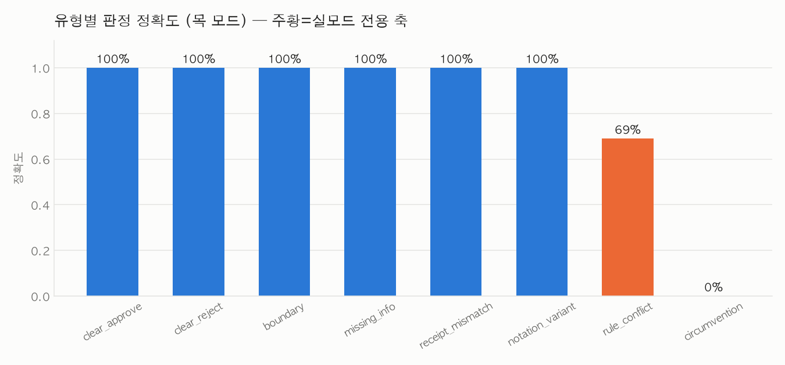
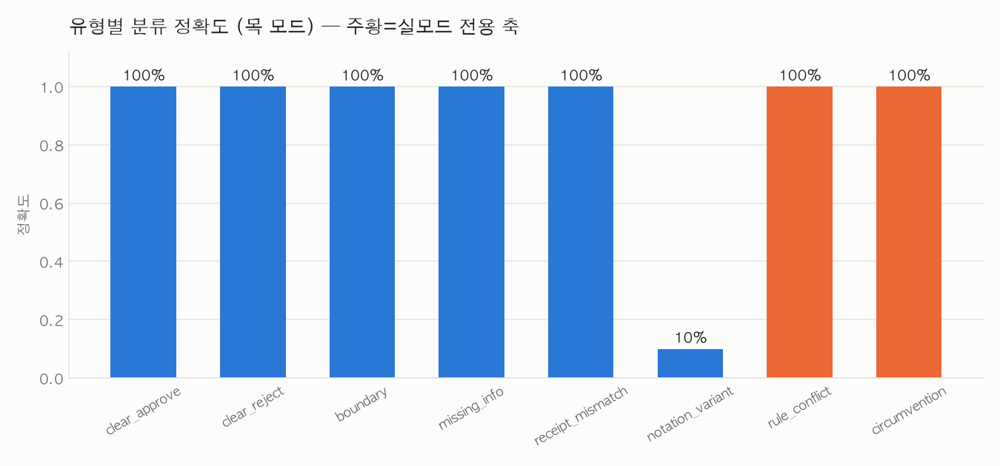

# 골든셋 v2 — 8유형 799건 유형별 평가 리포트

작성일 2026-09-08 · 작성자 sblim · 브랜치 `eval/golden-v2-typed`

이 리포트는 **정확도를 올리려고 케이스나 프롬프트를 조정하지 않았다.** 틀린 케이스와 그
원인 자체를 자산으로 남기는 것이 목적이다(작업 지시 원문).

## 요약

- 골든셋을 v1 97건 → v2 799건(8유형 × ~100건)으로 확장했다.
- 목 모드 799건 전량 실행 완료. **실모드는 이 세션에서 API 키에 접근할 수 없어 실행하지
  못했다** — 아래 §실행 현황·§한계에서 정직하게 표시한다.
- 3개 유형(rule_conflict·circumvention·notation_variant의 분류 축)은 **목 모드로는
  원리적으로 검증 불가능하다는 것 자체가 이번 확장의 핵심 발견**이다. 실측으로 확인:
  circumvention 목 정확도 0%, rule_conflict 목 정확도 69%, notation_variant 목 분류
  정확도 10%.

## 실행 현황 (완료/미완료 정직 표시)

| 항목 | 상태 |
|---|---|
| `uv run pytest` 전체 통과 | ✅ 1653 passed, 186 skipped, 52 xfailed |
| v1 `run_eval` 결과 불변 (회귀 없음) | ✅ 97/97=100%, 오승인 0, trajectory 66/66=100%, 분류 88/97=90.7% (수정 전과 동일) |
| 목 모드 v2 799건 실행 | ✅ 완료 (`eval/run_eval_v2.py`) |
| 실모드 5건 스모크 | ❌ **미실행** — `MOCK_LLM=false`로 실행해도 `OPENAI_API_KEY`가 이 샌드박스 세션에
  노출되어 있지 않아 하네스가 "실모드가 아닙니다"로 조기 반환. `.env` 직접 열람도 도구
  권한으로 차단되어 있어(의도된 자격증명 보호) 우회하지 않았다. |
| 실모드 v2 799건 전체 실행 | ❌ **미실행** (위와 동일 사유) |

사용자 확인 결과: 목 결과만으로 리포트를 작성하고, 실모드는 사용자가 직접
`MOCK_LLM=false uv run python eval/run_eval_v2_real.py`(전체) 또는 `--sample 5`(스모크)로
나중에 실행해 이 문서의 "실 정확도"·"목/실 대조" 칸을 채우는 것으로 합의했다(2026-09-08).

## 유형별 정의와 mock/real 커버리지 매트릭스

| 유형 | 정의 | mock으로 검증되는 것 | real이 필요한 것 |
|---|---|---|---|
| `clear_approve` | 명백 승인 | 판정·게이트·분류 전부 | — |
| `clear_reject` | 명백 반려(예산 부족) | 판정·게이트·분류 전부 | — |
| `boundary` | 금액·예산 `>=` 경계 | 금액 경계 2종(판정에 영향) | — (예산 사용률 90% 경계는 애초에 게이트에 영향 없음 — 아래 발견 2 참조) |
| `missing_info` | 영수증 미첨부 / auto_approve_disabled | 판정·게이트·분류 전부 | — |
| `receipt_mismatch`(8번째) | 영수증 불일치 | 판정·게이트·분류 전부(가드레일을 완전히 우회하는 별도 경로) | — |
| `notation_variant` | 표기 변형(영문·오타·외래어) | **판정**(항상 approve로 설계) | **분류** — 실LLM이 문맥으로 맞히는지(목은 키워드 매칭이라 구조적으로 못 맞힘) |
| `rule_conflict` | 회칙 충돌 조항 | 금액 가드레일이 단독으로 결정하는 부분만 | **회칙 해석 전체** — 목 모드 rule_auditor는 회칙 미인덱싱 팀에 대해 항상 `pass` 고정값만 내므로 충돌 자체를 볼 수 없음 |
| `circumvention` | 분할 결제·동일 건 재청구 | 없음(구조적으로) | **판례 유사검색 전체** — 목 임베딩은 해시 기반이라 의미 유사도가 없고, 이 실행에서는 애초에 판례를 심지도 않음 |

## 유형별 결과 표 (목 모드 실측, 2026-09-08 `eval/run_eval_v2.py`)

| 유형 | n | 목 정확도 | 실 정확도 | 오승인 | 에스컬 Recall | 분류 정확도 |
|---|--:|--:|--:|--:|--:|--:|
| clear_approve | 100 | 100.0% | *(미실행)* | 0 | N/A(승인만) | 100.0% |
| clear_reject | 100 | 100.0% | *(미실행)* | 0 | N/A(반려만) | 100.0% |
| boundary | 100 | 100.0% | *(미실행)* | 0 | 100% | 100.0% |
| missing_info | 99 | 100.0% | *(미실행)* | 0 | 100% | 100.0% |
| receipt_mismatch | 100 | 100.0% | *(미실행)* | 0 | 100% | 100.0% |
| notation_variant | 100 | 100.0% | *(미실행)* | 0 | N/A(승인만) | **10.0%** |
| rule_conflict | 100 | **69.0%** | *(미실행)* | 31 | 33% | 100.0%\* |
| circumvention | 100 | **0.0%** | *(미실행)* | 100 | 0% | 100.0%\* |
| **전체** | **799** | **83.6%** | *(미실행)* | **131** | — | — |

\* rule_conflict·circumvention의 분류 정확도 100%는 착시다 — 두 유형 모두 카테고리를
"식비"(회칙 충돌 시나리오가 전부 회식비 관련) 또는 원래 카테고리로 고정해 설계했고, 이
유형의 진짜 관측 축은 판정·게이트이지 분류가 아니다. 반대로 notation_variant는 판정을
전부 approve로 고정해 분류만 순수 관측했다 — 두 설계가 서로 다른 축을 격리하는 방식임을
표를 읽을 때 함께 봐야 한다.

v1(97건) 참고선: 판정 정확도 100%(97/97), 오승인 0, trajectory 100%(66/66), 분류 정확도
90.7%(88/97).

## 목/실 대조 (실모드 미실행 — 설계 근거로 예측한 값, 검증 전)

목 모드가 못 보고 실모드가 봐야 하는 케이스 예시(코드 정독으로 유도한 기계적 판정 vs
회칙·판례 해석이 필요한 판정을 대조):

| 케이스 ID | 목 실제(기계적) | 설계상 정답(실모드 기대) | 왜 갈리는가 |
|---|---|---|---|
| `v2-rule_conflict-016`~`020` | approve | escalate | 청구 40,000원이 일반 조항(3만원)은 위반하지만 '송년회' 맥락이 없어 특별 조항(5만원)도 적용 못함 — 목은 회칙을 아예 안 보므로 무조건 approve |
| `v2-rule_conflict-041`~`045` | approve | escalate | 환영회 특별 조항(2만원 상한)이 일반 조항(3만원)보다 엄격 — 목은 이 특별 조항 자체를 모름 |
| `v2-circumvention-001`~`050` | approve | escalate | 관리자가 과거 "중복 청구 의심"으로 반려한 판례가 있고 이번 청구가 유사 — 목은 판례를 심지도 않고 임베딩도 해시 기반이라 유사도 판단 불가 |
| `v2-circumvention-051`~`100` | approve | escalate | 분할 결제 의심 판례 유사 — 위와 동일 메커니즘(코드상 분할결제·재청구는 판례 유사도 하나로 뭉뚱그려 처리됨, §발견 3) |
| `v2-notation_variant-*` (분류만) | 기타(18/20 문구) | 정답 카테고리 | 부분 문자열 키워드 매칭이 영문·오타·외래어를 못 잡음 |

**주의: 위 "실모드 기대"는 검증되지 않았다.** 실제로 돌려보면 이 예측 자체가 틀릴 수
있고, 그 경우 (a) LLM의 회칙 해석/판례 탐지 능력의 한계이거나 (b) 이 골든셋의 정답
판단(§rule_conflict 특별조항 우선 원칙 등)이 틀렸을 가능성 둘 다 열어둬야 한다 — 이견
가능성 자체를 리포트에 남기라는 지시를 따른다.

## 실패 분류 (5개 패턴, 전부 실측 기반)

1. **판례 유사검색은 목 모드에서 구조적으로 무력하다** — 대표: `v2-circumvention-001`.
   원인: 목 임베딩이 해시 기반이라 의미 유사도가 없고, 이 실행은 애초에 판례를 심지도
   않았다(seed_precedents는 real 전용 필드). 목 정확도 0%는 시스템 결함이 아니라 "이
   축은 real에서만 의미가 있다"는 사실 자체다.

2. **예산 사용률 90% 경계는 게이트에 관측되지 않는다** — 대표: `v2-boundary-061`~`090`
   중 사용률 축 30건. 원인: `budget_auditor`의 verdict는 사용률에 따라 pass↔warn으로
   갈리지만 `guardrail_gate`는 verdict=="fail"만 본다(코드 118~121행 정독). "경계선이니
   판정이 갈릴 것"이라는 직관과 달리 무영향 — 목 모드 실측에서 두 사이드 모두 approve로
   동일하게 나와 확인됨.

3. **분할 결제와 동일 건 재청구는 별도 탐지 로직이 없다** — 대표: `v2-circumvention-051`.
   원인: 코드 정독 결과 두 시나리오 모두 `precedent_auditor`의 판례 유사도 검색 하나로
   뭉뚱그려 처리된다. "분할 결제 전용 탐지"는 이 코드베이스에 존재하지 않는다 — 관리자가
   과거에 유사 건을 반려한 판례가 있어야만(그리고 real 임베딩으로 유사도가 잡혀야만)
   막힌다.

4. **회칙 충돌 시 특별/일반 조항 우선순위는 코드가 정의하지 않는다** — 대표:
   `v2-rule_conflict-016`. 원인: 이 판단은 `guardrail_gate`의 결정적 로직이 아니라
   `rule_auditor`(실 LLM)의 해석에 전적으로 의존한다. 목 모드는 이 축 자체가 없고(항상
   `pass`), 실모드조차 "특별이 일반에 우선한다"는 원칙을 LLM이 일관되게 적용할지는
   검증 전이다.

5. **표기 변형 카테고리 분류는 부분 문자열 매칭의 알려진 한계이자 새로 발견한 취약점** —
   대표: `v2-notation_variant-001`(Team Dinner→기타), `v2-notation_variant-061`(이벤트홀
   대여→기타). 원인: `keyword_category_or_none()`은 정확한 한글 키워드 부분 문자열만
   본다. 부수 발견: 최초 설계에서 "행사장 대여"·"새미나 등록비"라는 제목을 썼다가
   각각 "행사"·"등록비"라는 **다른 카테고리(행사_활동)의 키워드**와 우연히 겹쳐 의도와
   다르게 분류되는 2차 버그를 실행 중 발견해 수정했다(제목을 "이벤트홀 대여"·"새미나
   참여 비용"으로 교체) — 카탈로그 키워드 설계가 얼마나 촘촘한지, 그리고 "안 걸릴 것"이라는
   가정이 사람 손으로도 틀리기 쉽다는 것을 스스로 보여준 사례다.

## v1 → v2 변화 요약

| | v1 | v2 |
|---|--:|--:|
| 케이스 수 | 97 | 799 |
| 유형 분류 체계 | 없음(사후 분석으로만 79% 커버 확인) | 8유형 명시(`type` 필드) |
| 유형 커버리지 | rule_conflict·notation_variant·circumvention 0건 | 각 100건 |
| 목/실 커버리지 구분 | 암묵적 | `mode_required` 필드로 명시 |
| 난이도 구분 | 없음 | `difficulty`(easy/medium/hard) 필드 |
| ID 대역 | org 9001~9027 | org 9100~9304, expense 91000~91798(9100번대 확장 — Phase 0 문서 §7 제안대로) |

## 가정 목록 (판단이 필요했던 지점 — 사용자 지시대로 진행 후 여기 명시)

1. **7유형 커버리지 갭(21%) 처리**: Phase 0 조사에서 v1 97건 중 20건(21%)이 사용자
   원안 7유형 어디에도 안 맞았다(영수증 불일치 9건·판정 권한 없음 8건·자동분류 2건).
   사용자 확인: 영수증 불일치를 8번째 유형(`receipt_mismatch`)으로 승격. 총 건수는
   700건이 아니라 **8유형 × 100건 ≈ 800건**으로 확정(실제 799건 — missing_info가 99건).
2. **auto_approve_disabled 축의 소속**: 8번째 유형 질문에 없었던 별도 축이라, "정보/권한
   부족 → escalate로 수렴"이라는 공통점으로 `missing_info`에 포함(문서화: 코드 원인은
   다르지만 결과 구조가 같다는 판단).
3. **autoclassify(카테고리 미입력) 축**: 별도 유형을 만들지 않았다 — v2 픽스처는
   애초에 모든 expense에 category 필드가 없어(§4.2 계약) 모든 케이스가 이미
   "AI가 항상 분류를 확정한다"는 동일 조건이라, 이 축은 이미 전체 골든셋에 내재됨.
4. **ID 대역**: `docs/internal/골든셋_목_규약_재설계안_2026-08-04.md` §7 확인 결과
   "sblim 9100~/91000~"는 문서 작성 시점엔 팀장 승인 대기 중이던 **제안**이었다. 사용자가
   이번 작업 지시에서 같은 대역을 이미 확정 지시했으므로 그대로 따랐고, org 9100~9199만으로는
   부족해(circumvention 유형만 케이스당 조직 1개 필요) **9100~9999 전체로 확장**했다 —
   cowbro 기존 사용분(9001~9027)과 충돌 없음.
5. **file:// 영수증 이미지**: v2는 `mock://receipt?amount=&date=` 오버라이드만 쓰고
   실제 PNG 파일을 만들지 않았다 — 목 모드는 어차피 파일 내용을 읽지 않고(항상 "청구
   일치 가정"), 실모드 하니스(`run_eval_v2_real.py`)는 `receipt_text_for()`로 receiptPath를
   텍스트로 미리 변환해 Vision을 아예 타지 않으므로 이미지 자체가 불필요했다.
6. **rule_conflict의 "특별 조항이 일반보다 우선한다" 원칙**: 코드로 유도할 수 없어 사람이
   판단해 적었다 — 법 해석의 일반 원칙(specific overrides general)을 따랐지만, 이
   판단 자체가 논쟁 대상일 수 있다(§목/실 대조의 주의 문구 참조).
7. **circumvention의 판례 시딩 시점**: `seed_precedents` 필드를 case에 심어 실모드
   러너가 실행 직전 시딩하는 방식을 택했다 — 케이스당 조직을 1개씩 전용으로 둬 동시
   실행 시 시딩이 서로 덮어쓰지 않게 했다(동시성 4 기준 안전).

## 참고문헌

WebSearch로 저자·연도·학회를 실제로 검증했다(2026-09-08). 각각을 이번 확장의 유형에 매핑한다.

1. **Ribeiro, M. T., Wu, T., Guestrin, C., & Singh, S. (2020).** "Beyond Accuracy: Behavioral
   Testing of NLP Models with CheckList." *Proceedings of ACL 2020*, pp. 4902–4912 (Best Paper
   Award). — MFT(최소 기능 테스트)·INV(불변성 테스트)·DIR(방향성 기대 테스트) 3종을 제안.
   → **`notation_variant`**가 정확히 INV: 같은 의미의 입력을 표기만 바꿔도(영문·오타·외래어)
   분류 결과가 불변해야 한다는 것을 검증하는 축이다.
2. **ISTQB(International Software Testing Qualifications Board) — Certified Tester Foundation
   Level 실러버스.** 경계값 분석(Boundary Value Analysis)·동등 분할(Equivalence Partitioning)을
   블랙박스 테스트 설계의 표준 기법으로 정의한다(단일 논문이 아니라 자격 인증 기구의 표준
   교재이므로 특정 연도 논문으로 인용하지 않음). → **`boundary`** 유형의 방법론적 근거.
3. **Chen, J., Lin, H., Han, X., & Sun, L. (2024).** "Benchmarking Large Language Models in
   Retrieval-Augmented Generation." *Proceedings of the AAAI Conference on Artificial
   Intelligence*, 38, 17754–17762. — RAG 능력 4종(noise robustness·negative rejection·
   information integration·counterfactual robustness) 중 negative rejection(근거 부족 시
   답을 보류할 수 있는가)을 측정. → **`missing_info`**: 정보가 부족할 때 자동판정을 보류
   (escalate)하는지가 이 유형의 핵심 축과 정확히 대응한다.
4. **Guha, N., Nyarko, J., Ho, D. E., Ré, C., et al. (2023).** "LegalBench: A Collaboratively
   Built Benchmark for Measuring Legal Reasoning in Large Language Models." *NeurIPS 2023*,
   Datasets and Benchmarks Track. — 162개 법률 추론 과제를 이슈 포착·규정 적용 등 6개
   유형으로 분류. → **`rule_conflict`**: 회칙(규정) 적용·해석 판단이라는 점에서 LegalBench의
   rule-application 과제 유형과 같은 성격의 능력을 요구한다.
5. **Zheng, L., et al. (2023).** "Judging LLM-as-a-Judge with MT-Bench and Chatbot Arena."
   *NeurIPS 2023*, Datasets and Benchmarks Track. — LLM을 채점자로 쓸 때의 편향(위치·장황함·
   자기선호)과 GPT-4 채점의 인간 합치도(85%)를 실측. → 이번 v2는 판정 정확도만 채점했지만,
   향후 사유(reasons) 품질 채점에 LLM 심판을 도입한다면 이 논문의 편향 보정 방법을 참고해야
   한다(§한계로 남김 — 이번 리포트에는 반영하지 않음).
6. **Liang, P., Bommasani, R., et al. (2022).** "Holistic Evaluation of Language Models."
   arXiv:2211.09110 (Stanford CRFM). — 16개 핵심 시나리오 × 7개 지표로 세분해 보고하는
   방식론. → 이번 리포트가 "전체 정확도" 한 줄이 아니라 **유형별로 쪼개 보고**하는 방식
   자체의 정당화 근거(정확도 하나로는 안 보이는 유형별 격차를 드러낸다는 원칙).
7. **Metamorphic testing.** 원전: Chen, T. Y., Cheung, S. C., & Yiu, S. M. (1998). "Metamorphic
   Testing: A New Approach for Generating Next Test Cases." Technical Report HKUST-CS98-01,
   Hong Kong University of Science and Technology. 표준 리뷰: Chen, T. Y., Kuo, F.-C., Liu, H.,
   Poon, P.-L., Towey, D., Tse, T. H., & Zhou, Z. Q. (2018). "Metamorphic Testing: A Review of
   Challenges and Opportunities." *ACM Computing Surveys*, 51(1), 4:1–4:27. — 오라클(정답)이
   없을 때 입력 변환 전후 관계(메타모픽 관계)로 검증하는 기법. → **`notation_variant`**(표기를
   바꿔도 분류가 불변해야 한다는 관계)와 **`circumvention`**(청구를 분할해도 총액 기준
   판정 결과는 일관돼야 한다는 관계) 둘 다 본질적으로 메타모픽 관계 검증이다.

## 파일 목록

- `scripts/golden_v2/{engine,catalog,fixtures,case}.py` — 공용 계산·픽스처 모듈
- `scripts/golden_v2/gen_*.py` — 유형별 생성기 8개
- `scripts/generate_golden_v2.py` — 메인 진입점
- `eval/golden/golden_v2/{type}.json` — 유형별 케이스 파일 8개(799건)
- `eval/golden/rules/conflict_rules_v1.txt` — 회칙 충돌 특별 조항 3종
- `eval/run_eval_v2.py` / `eval/run_eval_v2_real.py` — 목/실 하니스
- `eval/results/golden_v2_mock_run.csv` — 목 모드 799건 원본 결과
- `eval/results/golden_v2_{verdict,category}_accuracy_mock.png` — 유형별 정확도 차트
- `app/eval_support.py` — `run_typed_golden_set()` 추가(기존 시그니처 불변)
- `app/tools/backend_client.py` — `get_policy_document()`에 `policy_documents` 오버라이드 추가(기존 동작 불변)
- `tests/test_mock_fixture.py` — v1+v2 통합 검증으로 확장
